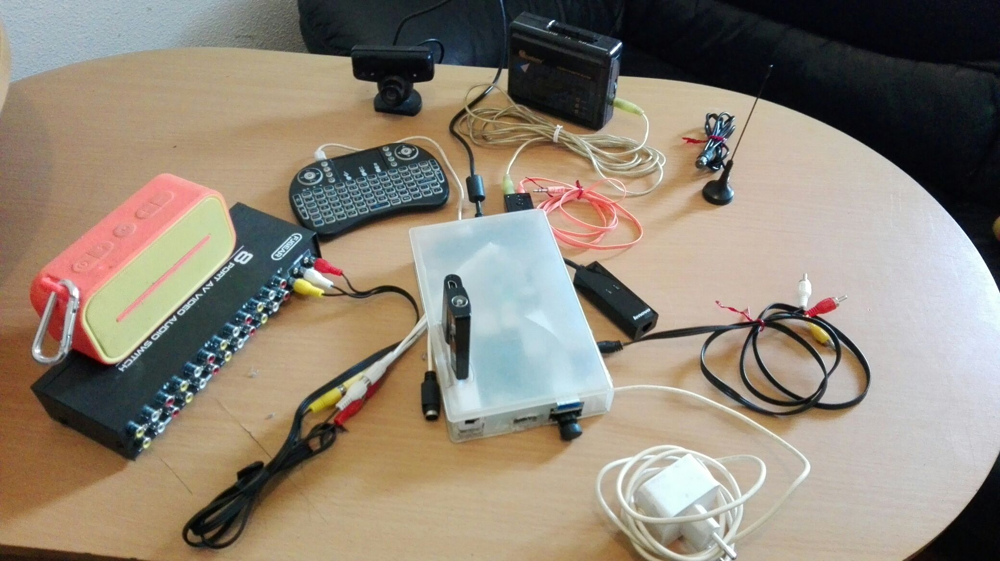
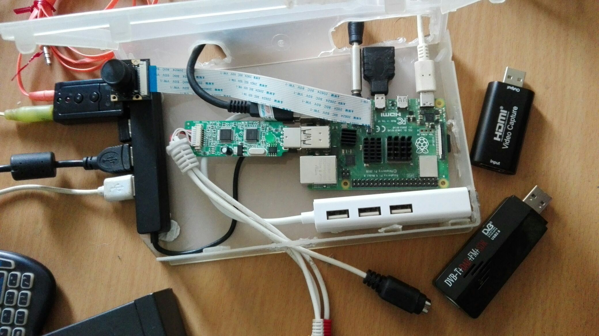
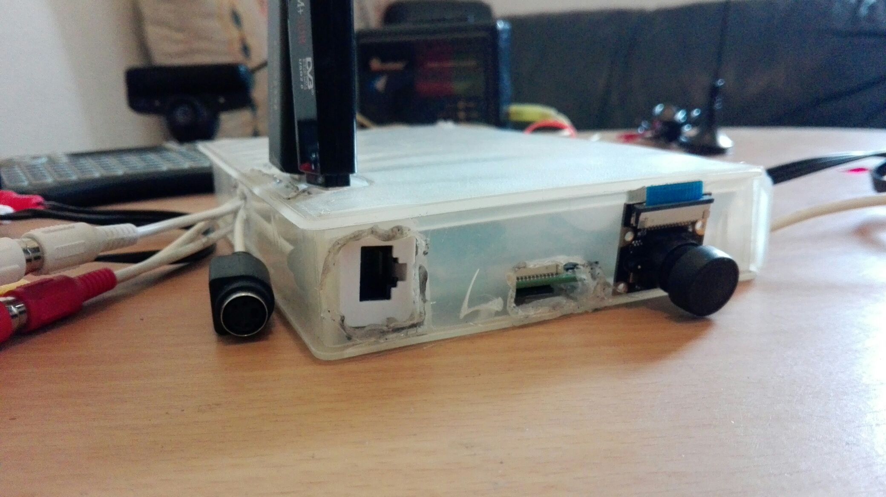
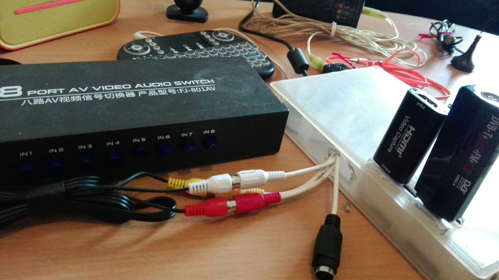
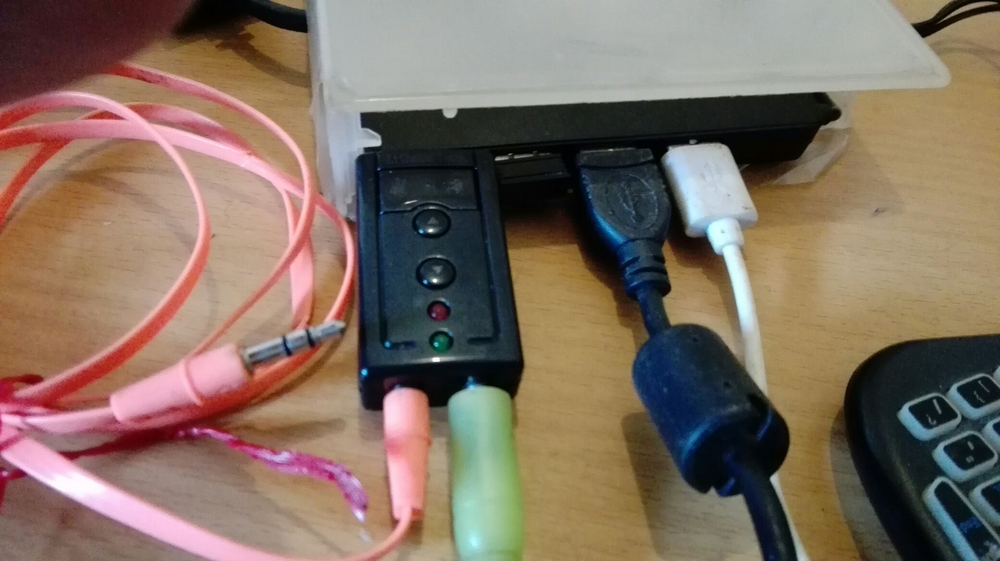
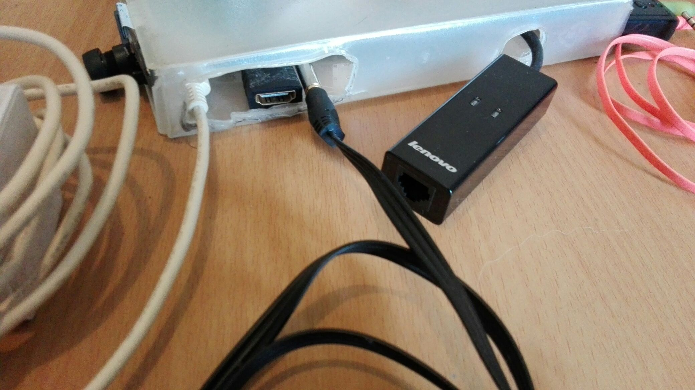

# FatScreen

### Inputs
- analog audio (mic/cassette player)
- RCA (consoles/VHS) 
  - optional 8 x switch
- hdmi 
- RF cable (TV antena)
- pseye (camera + mic)
- ethernet/wifi
- usb remote/keyboard
- pi camera

### Outputs
- RCA (old TVs)
   - optional RCA to SCART adapter
- hdmi (new TVs)
   - optional micro-hdmi to hdmi adapter
   - optional hdmi to VGA adapter (pc monitors)
- audio jack (external speaker)
- bluetooth (external speaker)
- ethernet (go online with playstation 2)
- dial up modem (go [online with dreamcast](https://dreamcast.wiki/DreamPi))
- usb port for charging remote/bluetooth speaker

### Pictures

